# Kotlin基础语法

## 程序代码基本结构 

经典的Hello World代码

```kotlin
fun main() {
    println("Hello World!")
}
```

在编写代码时，注意需要区分大小写，Kotlin语言严格区分大小写，如果我们没有按照规则来编写，那么就会出现红色波浪线报错：

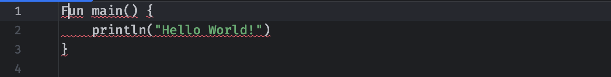

只要源代码中存在报错的地方，就无法正常完成编译得到字节码文件，强行运行会提示构建失败：

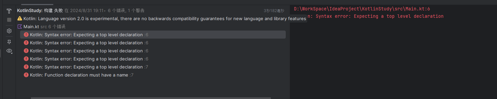

注意这里包括的花括号是成对出现的，并且一一对应。

一定要注意大小写。然后第二行，准确的说是最外层花括号内部就是：

```kotlin
fun main() {
  
}
```

可以看到外面使用花括号前添加了`fun main()`，这是我们整个程序的入口点，我们的Kotlin程序也是从这里开始从上往下执行的。而其中的`println`语句就是用于打印其括号中包裹的文本，我们可以看到这个文本信息使用了`""`进行囊括，否则会报错：

```kotlin
println("Hello World!")
```

这段代码的意思就是将双引号括起来的内容（字符串）输出（打印）到控制台上。

比如下面的代码，我们就可以实现先打印Hello World!，然后再打印 KFC vivo 50 到控制台：

```kotlin
fun main() {
    println("Hello World!")
    println("KFC vivo 50")
}
```

效果如下：


注意我们上面编写的打印语句其实是函数的调用（后续会进行讲解）不能写到同一行中，否则编译器会认为是同一句代码，同样会导致编译不通过：

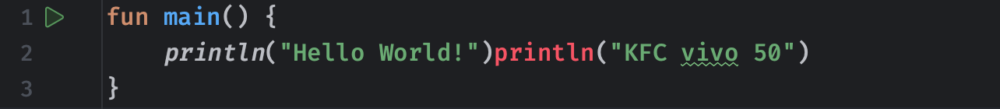

如果实在要写到同一行，那么我们需要在上一句代码最后添加`;`来表示上一段的结束：

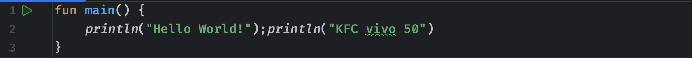

再比如下面的代码：

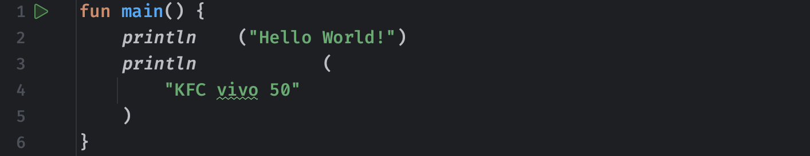

这里我们尝试在中途换行或是添加空格，因为没有添加分号，所以说编译器依然会认为是一行代码，因此编译不会出现错误，能够正常通过。当然，为了代码写得工整和规范，我们一般不会随意换行或是添加没必要的空格。注意随意换行和空格仅限于可分割区域，比如`println`本身是一个函数的完整名称，这就不能从中间直接断开，否则语义就完全不一样了。

## 注释：

```kotlin
/**
 * 文档注释
 * @author 一只咕咕鱼
 * @since 2024-8-31
 */
fun main()
{
    //单行注释，V我50
    println("vivo 50")
    /*多行注释
    qwq
     */
}
```

文档注释可以自动生成文档

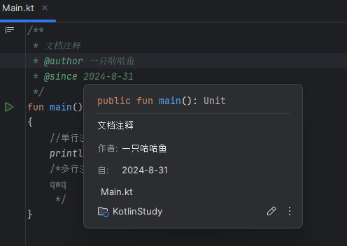

## 变量与基本类型

我们的程序不可能永远都只进行上面那样的简单打印操作，有些时候可能需要计算某些数据，此时我们就需要用到变量了。那么，什么是变量呢？

> 变量，指值可以变的量。变量以非[数字](https://baike.baidu.com/item/数字/6204?fromModule=lemma_inlink)的符号来表达，一般用拉丁字母。变量的用处在于能一般化描述指令的方式。结果只能使用真实的值，指令只能应用于某些情况下。变量能够作为某特定种类的值中任何一个的保留器。

比如一个公式 x + 2 = 6 此时`x`就是一个变量，变量往往代表着某个值，比如这里的`x`就代表的是4这个值。在Kotlin中，我们也可以让变量去代表一个具体的值，并且变量的值是可以发生变化的，在程序中，我们也可以使用变量，并且变量具有类型。

## 计算机中的二进制表示（选学）

进入到变量的学习之前，我们需要先补充一下计算机的底层知识，否则各位小伙伴后面听起来会很困难。

在计算机中，所有的内容都是二进制形式表示。十进制是以10为进位，如9+1=10；二进制则是满2进位（因为我们的计算机是电子的，电平信号只有高位和低位，你也可以暂且理解为通电和不通电，高电平代表1，低电平代表0，由于只有0和1，因此只能使用2进制表示我们的数字！）比如1+1=10=2^1+0，一个位也叫一个bit，8个bit称为1字节，16个bit称为一个字，32个bit称为一个双字，64个bit称为一个四字，我们一般采用字节来描述数据大小。

注意这里的bit跟我们生活中的网速MB/s是不一样的，小b代表的是bit，大B代表的是Byte字节（8bit = 1Byte字节），所以说我们办理宽带的时候，100Mbps这里的b是小写的，所以说实际的网速就是100/8 = 12.5 MB/s了。

> 十进制的7 -> 在二进制中为 111 = 2^2 + 2^1 + 2^0

现在有4个bit位，最大能够表示多大的数字呢？

- 最小：0000 => 0
- 最大：1111 => 2^3+2^2+2^1+2^0 => 8 + 4 + 2 + 1 = 15

在Kotlin中，无论是小数还是整数，他们可以带有符号，因此，首位就作为我们的符号位，还是以4个bit为例，首位现在作为符号位（1代表负数，0代表正数）：

- 最小：1111 => -(2^2+2^1+2^0) => -7
- 最大：0111 => +(2^2+2^1+2^0) => +7 => 7

现在，我们4bit能够表示的范围变为了-7~+7，这样的表示方式称为**原码**。虽然原码表示简单，但是原码在做加减法的时候，很麻烦！以4bit位为例：

> 1+(-1) = 0001 + 1001 = 怎么让计算机去计算？（虽然我们知道该去怎么算，但是计算机不知道！）

我们得创造一种更好的表示方式！于是我们引入了**反码**：

- 正数的反码是其本身
- 负数的反码是在其原码的基础上, 符号位不变，其余各个位取反

经过上面的定义，我们再来进行加减法：

> 1+(-1) = 0001 + 1110 = 1111 => -0 （直接相加，这样就简单多了！）

思考：1111代表-0，0000代表+0，在我们实数的范围内，0有正负之分吗？0既不是正数也不是负数，那么显然这样的表示依然不够合理！根据上面的问题，我们引入了最终的解决方案，那就是**补码**，定义如下：

- 正数的补码就是其本身 （不变！）
- 负数的补码是在其原码的基础上, 符号位不变, 其余各位取反, 最后+1（即在反码的基础上+1，此时1000表示-8）
- 对补码再求一次补码就可得该补码对应的原码。

比如-7原码为1111，反码为1000，补码就是1001了，-6原码为1110，反码为1001，补码就是1010。所以在补码下，原本的1000就作为新增的最小值-8存在。

所以现在就已经能够想通，-0已经被消除了！我们再来看上面的运算：

> 1+(-1) = 0001 + 1111 = (1)0000 => +0 （现在无论你怎么算，也不会有-0了！）

所以现在，1111代表的不再是-0，而是-1，相应的，由于消除-0，负数多出来一个可以表示的数（1000拿去表示-8了），那么此时4bit位能够表示的范围是：-8~+7（Kotlin使用的就是补码！）在了解了计算机底层的数据表示形式之后，我们再来学习这些基本数据类型就会很轻松了。

## 变量的声明与使用

格式:

```kotlin
var [变量名称] : [数据类型]
```

不同类型的变量可以存储不同的类型的值。后面的变量名称顾名思义，就像`x`一样，这个名称我们可以随便起一个，但是注意要满足以下要求：

- 标识符可以由大小写字母、数字、下划线(_)和组成，但是不能以数字开头。
- 变量不能重复定义，大小写敏感，比如A和a就是两个不同的变量。
- 不能有空格、@、#、+、-、/ 等符号。
- 应该使用有意义的名称，达到见名知意的目的（一般我们采用英文单词），最好以小写字母开头。
- 不可以是 true 和 false。
- 不能与Kotlin语言的关键字或是基本数据类型重名

```kotlin
fun main()
{
    var x : Int = 10 //完整的声明
    var y = 10 //也可以使用自动推断
    var qwq : Int // 也可以不指定默认数值
    //println(qwq); 不可以没设置默认值直接使用、
    val awa = 1000
    //awa = 2000; //val 声明的变量为常量，不可修改
}
```

### 数字类型

Kotlin提供了一组表示数字的内置类型，对于整数，有四种不同大小的类型，因此，值范围：

| 类型  | 大小（位） | 最小值                             | 最大值                                |
| ----- | ---------- | ---------------------------------- | ------------------------------------- |
| Byte  | 8          | -128                               | 127                                   |
| Short | 16         | -32768                             | 32767                                 |
| Int   | 32         | -2,147,483,648 (-2^31)             | 2,147,483,647（2^31-1）               |
| Long  | 64         | -9,223,372,036,854,775,808 (-2^63) | 9,223,372,036,854,775,807（2^63 - 1） |

为什么不同的数据类型有着值范围呢？这是因为我们的计算机底层是采用0和1表示数据的，并且数据的表示位数有限，我们以二进制来计算，就像下面这样：

> 1 + 1 = 10
>
> 可能很多小伙伴会好奇，为什么1 + 1得到的结果是数字十？这是因为二进制中只有0和1，因此只要满二就进一，所以就变成这样的结果了，如果各位是初次学习，可能会不太好理解。

这里以上面的8位大小的Byte类型为例，在计算机底层存储数据时，只有8个bit位（一个bit位就可以表示一个0或1）来存储它，那么它能表示的最大值和最小值就是：

> 00000000 ~ 11111111   转换为十进制就是   0 ~ 255

不过为了能够表示负数，计算机一般使用补码进行表示，所以，上面的最小值和最大值就变成了-128 ~ 127了。

默认情况下，我们使用的常量数字都是Int类型，除非它的大小已经超出Int类型能够表示的最大范围，在超出Int类型可以表示的最大范围之后，默认为Long类型： 

```kotlin
val one = 1 // Int
val threeBillion = 3000000000 // Long
val oneLong = 1L // 我们也可以在数字后面添加大写字母L来表示这是一个Long类型的数值
val oneByte: Byte = 1   //Int类型数据也可以在符合其他类型范围时自动转换
```

对于一些比较长的数字，我们可能需要使用类似于分隔符一类的东西来方便我们计数，比如：

> 银行往往把1000000000这种长数字记为1,000,000,000，这样看起来会更直观

在Kotlin中也可以像这样去编写：

```kotlin
val a = 1_000_000_000
```

数字类型不仅可以写成十进制，也可以以十六进制或是二进制表示（Kotlin不支持八进制表示）只需要添加对应的前缀即可，比如一个十六进制数据：

```kotlin
val a = 0xAF
```

因为十六进制中大于等于十的数据没有对应的阿拉伯数字可以表示，所以在计算机中就以ABCDEF来替代这无法表示的6个数字。并且我们需要在数字前面添加0x表示这是16进制的数字，接下来是2进制：

```kotlin
val a = 0b1001   //0b前缀表示二进制数据，后面的1010对应着十进制的9
```

除了整数类型外，Kotlin还为无符号整数提供以下类型：

- `UByte`：一个无符号8位整数，范围从0到255
- `UShort`：无符号16位整数，范围从0到65535
- `UInt`：一个无符号32位整数，范围从0到2^32 - 1
- `ULong`：一个无符号64位整数，范围从0到2^64 - 1

为了使无符号整数更易于使用，Kotlin同样提供了用后缀标记，该后缀表示无符号类型（类似于上面的`Long`类型添加L字母）

- 使用`u`或`U`字母作为后缀表示无符号整数。而具体的类型是根据前面变量的类型确定的，如果变量没有提供类型，编译器将根据数字的大小使用`UInt`或`ULong`：

  ```kotlin
  val b: UByte = 1u  // UByte类型, 由变量提供的类型
  val s: UShort = 1u // UShort类型, 由变量提供的类型
  val l: ULong = 1u  // ULong类型, 由变量提供的类型
  
  val a1 = 42u    // UInt类型，根据数字大小自动推断得到
  val a2 = 0xFFFF_FFFF_FFFFu // ULong类型，根据数字大小自动推断得到
  ```

- `uL`和`UL`可以将文字直接标记为无符号Long类型：

  ```kotlin
  val a = 1UL // ULong类型，直接使用后缀标记
  ```

对于小数来说，Kotlin提供符合IEEE [754标准的](https://en.wikipedia.org/wiki/IEEE_754)浮点类型`Float`和`Double`，`Float`为IEEE 754标准中的单精度数据，而`Double位标准中的双精度数据，对于单双精度，本质上就是能够表示的小数位精度，双精度比单精度的小数精度更高。

这些类型的大小不同，并为不同精度的浮点数提供存储：

| 类型     | 大小（位） | 符号与尾数位数 | 阶码位数 | 小数位数 |
| -------- | ---------- | -------------- | -------- | -------- |
| `Float`  | 32         | 24             | 8        | 6-7      |
| `Double` | 64         | 53             | 11       | 15-16    |

也可以直接创建小数类型的`Double`和`Float`变量，小数部分与整数部分由一个小数点（`.`）隔开，编译器默认情况下会将所有的小数自动推断为推断`Double`类型：

```kotlin
val pi = 3.1415 // 默认推断为Double类型
val one: Double = 1 // 这种写法是错误的，因为1不是小数，无法编译通过
val one: Double = 1.0 // 但是这种写法就是对的，因为这样表示就是小数，即使小数位是0
```

由于默认是Double类型，如果我们要明确指定值为`Float`类型，那么需要添加后缀`f`或`F`，并且由于精度问题，如果该值包含超过6-7位小数，则会丢失一部分精度：

```kotlin
val e = 2.7182818284 // Double类型的数值
val e: Float = 2.7182818284f // 这里表示为Float会导致精度折损，得到2.7182817
```

与其他一些语言不同，Kotlin中的数字类型没有隐式转换的操作，例如，一个`Double`类型的变量无法将其值赋值给`Int`类型变量：

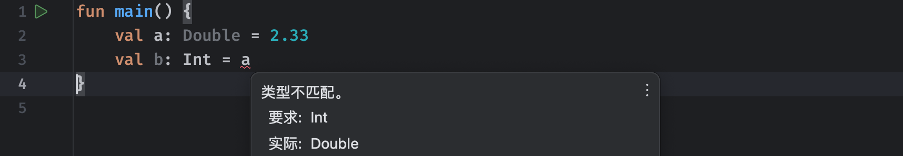

#### 数字的运算

Kotlin支持数学上标准的算术运算集，例如：`+`，`-`，`*`，`/`，`%` 并且这些运算符都是通过运算符重载实现的具体功能

> Kotlin支持运算符重载，运算符重载是一种允许程序员重新定义运算符的语言特性，通过运算符重载，您可以为自定义的类或数据类型定义一些特定操作的行为。

其中加减乘除操作这里就不做介绍了，而%符号用于取余操作，也就是计算前面的数整除后面的数得到的余数：

```kotlin
println(1 + 2)   //计算1加上2的结果
println(2_500_000_000L - 1L)   //计算2500000000减去1的结果
println(3.14 * 2.71)   //计算3.14与2.71的乘积
println(10.0 / 3)   //计算10除以3得到的结果
println(10 % 3)   //10除以3得到的余数为1
```

以上运算都比较简单，但是注意在除法运算中，只有两个操作数中出现小数，除法的结果才是小数，如果两个操作数都是整数，那么得到的结果也是整数，并且直接丢失小数位（不会四舍五入）

```kotlin
println(5 / 2)    //结果是2，而不是2.5
```

同样的，除了直接使用字面量来进行运算，我们也可以将定义的变量参与到运算中：

```kotlin
fun main() {
    val a = 10
    println(a / 2)
}
```

注意，在Kotlin中不同的算数运算符，它们的优先级也不一样：

```kotlin
println(1 + 2 * 3)
```

在数学中，乘法运算的优先级比加法运算更高，因此我们需要先计算乘法，再计算加法，而在Kotlin中是一样的，乘法和除法运算符的优先级是高于加法运算符的，所以说上面算出来的结果是7，同样的，我们数学中使用括号来提升某些运算的优先级，在Kotlin中同样可以，比如：

```kotlin
println((1 + 1) * 3)   //使用小括号来强制提升优先级
```

有些时候，我们可能想要让某个变量的值增加一定数值，比如下面这样：

```kotlin
var a = 10
a = a + 9   //让a等于a+9的结果
```

对于这种让变量本身加减乘除某个值的情况，可以使用赋值运算符简化：

```kotlin
a += 9   //等价于 a = a + 9
a /= 9   //等价于 a = a / 9
a %= 2   //等价于 a = a % 2
```

如果我们只是希望某个变量自增或自减1，那么我们可以像这样去写：

```kotlin
fun main() {
    var a = 10
    a++    //使用两个++表示自增1
    println(a)     //打印得到11
  	a--    //使用两个--表示自减1
}
```

不过，这个双++符号，可以放在变量的前后，都能实现自增操作：

```kotlin
var a = 10
++a   //最终效果等价于a++
```

但是他们有一个本质区别，就是++在前面，a是先自增再得到结果，而++在后面，是a先得到结果，再进行自增，比如：

```kotlin
fun main() {
    var a = 10
    println(a++)   //这里++在后面，打印a的值依然是10，但是结束之后a的值就变成11了
    println(++a)   //这里++在前面，打印a的值是这里先自增之后的结果，就是12了
}
```

Kotlin提供了一组整数的*位运算*操作，可以直接在二进制层面上与数字表示的位进行操作，不过只适用于`Int`和`Long`类型的数据：

- `shl(bits)`– 有符号左移
- `shr(bits)`– 有符号右移
- `ushr(bits)`– 无符号右移
- `and(bits)`– 按位与
- `or(bits)`– 按位或
- `xor(bits)`– 按位异或
- `inv()`– 取反

这里我们从按位与开始讲解，比如下面的两个数：

```kotlin
fun main() {
    val a = 9
    val b = 3
    val c = a and b //进行按位与运算
    println(c)
}
```

按位与实际上就是让这两个数每一位都进行比较，如果这一位两个数都是1，那么结果就是1，否则就是0：

- a = 9 = 1001
- b = 3 = 0011
- c = 1 = 0001（因为只有最后一位，两个数都是1，所以说结果最后一位是1，其他都是0）

同样的，按位或，其实就是只要任意一个为1（不能同时为0）那么结果就是1： 

```kotlin
fun main() {
    val a = 9
    val b = 3
    val c = a or b
    println(c)
}
```

- a = 9 = 1001
- b = 3 = 0011
- c =11= 1011（只要上下有一个是1或者都是1，那结果就是1）

按位异或的意思就是只有两边不相同的情况下，结果才是1，也就是说一边是1一边是0的情况：

- a = 9 = 1001
- b = 3 = 0011
- c =10= 1010（从左往右第二位、第四位要么两个都是0，要么两个都是1，所以说结果为0）

按位取反操作跟前面的正负号一样，只操作一个数，最好理解，如果这一位上是1，变成0，如果是0，变成1：

- 127 = 01111111
- -128 = 10000000

所以说计算的结果就是-128了。

除了以上的四个运算符之外，还有位移运算符，比如：

```kotlin
fun main() {
    val c = 1 shl 2 //shl表示左移运算
    println(c)
}
```

- 1 = 00000001
- 4 = 00000100（左移两位之后，1跑到前面去了，尾部使用**0**填充，此时就是4）

我们发现，左移操作每进行一次，结果就会x2，所以说，除了直接使用`*`进行乘2的运算之外，我们也可以使用左移操作来完成。

同样的，右移操作就是向右移动每一位咯：

```kotlin
fun main() {
    val c = 8 shr 2  //shr表示右移运算
    println(c)
}
```

跟上面一样，右移操作可以快速进行除以2的计算。对于负数来说，左移和右移操作不会改变其符号位上的数字，符号位不受位移操作影响：

```kotlin
fun main() {
    val c = -8 shr 2   //这里得到的依然是个负数
    println(c)
}
```

我们也可以使用考虑符号位的右移操作，一旦考虑符号位，那么符号会被移动：   

```kotlin
fun main() {
    val c = -1 ushr 1 //无符号右移是ushr，移动会直接考虑符号位
    println(c)
}
```

比如：

- -1 = 11111111 11111111 11111111 11111111
- 右移： 01111111 11111111 11111111 11111111（无符号右移使用0填充高位）

此时得到的结果就是正数的最大值 2147483647 了，注意，不存在无符号左移操作。

总结一下不同运算符的优先级，对应的优先级从上往下依次减弱：

1. 一元运算符：例如 ++、--、+、-、!、~
2. 乘法和除法运算符：*、/、%
3. 加法和减法运算符：+、-
4. 位移运算符：shl、shr、ushr
5. 按位与运算符：and
6. 按位或运算符：or
7. 按位异或运算符：xor
8. 逻辑运算符：&&、||
9. 比较运算符：>、>=、<、<=、==、!=
10. 区间运算符：..
11. 赋值运算符：=、+=、-=、*=、/=、%=

## 布尔类型介绍

布尔类型是Kotlin中的一个比较特殊的类型，它并不是存放数字的，而是状态，它有下面的两个状态：

- true - 真
- false - 假

布尔类型（boolean）只有`true`和`false`两种值，也就是要么为真，要么为假，布尔类型的变量通常用作流程控制判断语句（不同于C语言，C语言中一般使用0表示false，除0以外的所有数都表示true）

```kotlin
val a: Boolean = true
```

如果给一个其他的值，会无法编译通过：

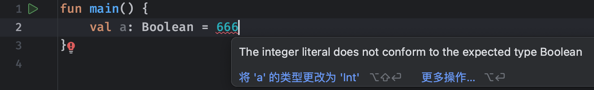

布尔值除了可以直接赋值得到，也可以通过一些关系运算得到，常见的关系运算有大于、小于以及等于，所有的关系运算在下方：

- 判断两个数是否相等：`a == b`和`a != b`
- 判断数之间大小：`a < b`，`a > b`，`a <= b`，`a >= b`
- 判断数是否在指定范围中：`a..b`，`x in a..b`，`x !in a..b`

比如我们想判断变量a和变量b的值是否相同： 

```kotlin
fun main() {
    val a = 10
    val b = 8
    println(a == b)  //判断a是否等于b（注意等号要写两个，因为单等号为赋值运算）
    println(a >= b)   //判断a是否大于等于b
    println(a < b)   //判断a是否小于b
  	val c: Boolean = a != b   //判断a是否不等于b并将结果赋值给变量c
}
```

可以看到，通过逻辑运算得到的结果，都是true或false，也就是我们这里学习的Boolean类型值。在Kotlin中，我们为了快速判断某个数是否在一个区间内，可以直接使用 `a..b` 来表示一个数学上`[a, b]`这样的闭区间，比如我们这里要判断变量`a`的值是否在1~10之间：

```kotlin
fun main() {
    val a = 10
    println(a in 1..10)   //这里1..10表示1~10这个闭区间，使用in关键字来进行判断
  	println(a in 1..<10)   //这里1..<10表示1~10这个前闭后开区间，使用in关键字来进行判断
  	println(a !in 1..10)   //相反的，使用!in判断是否不在这个区间
}
```

对于Boolean类型的变量之间，也有一些逻辑运算符用于进行组合条件判断：

- `||`– 逻辑或运算
- `&&`– 逻辑与运算
- `!`– 取反运算

其中取反运算最好理解，它可以让true变成false，false变为true，比如：

```kotlin
fun main() {
    val a = 10
    val b = 20
    val c = a > b   //这里很明显c应该为false
    println(!c)   //这里进行了取反操作并打印，那么结果就是true了
}
```

对于逻辑与和逻辑或运算，我们可以像这样去使用：

```kotlin
fun main() {
    val a = 10
    val b = 0
    println(100 >= a && b >= 60)  //我们可以使用与运算符连接两个判断表达式，只有两边都为true结果才是true
    println(100 >= a || b >= 60)  //我们可以使用或运算符连接两个判断表达式，只要两边任意一个为true结果就是true
}
```

与运算符要求左右两边同时为真，得到的结果才是真，否则一律为假，而或运算就是要求两边只要有一边为真，结果就是真，除非两边同时为false，那么就没戏了。

不过需要注意的是，在与运算中，第一个判断表达式得到了`false`之后，此时不会再继续运行第二个表达式，而是直接得到结果`false`（逻辑运算符会出现短路的情况，只要第一个不是真，就算第二个是真也不可能了，所以说为了效率，后续就不用再判断了，在使用时一定要注意这一点）同样的，或运算下当发现第一个判断表达式为true时，也不会继续向后执行了，因为结果已经是顶真了。

## 字符类型介绍

字符类型也是一个重要的基本数据类型，它可以表示计算机中的任意一个字符（包括中文、英文、标点等一切可以显示出来的字符）字符由`Char`类型表示，字符值用单引号：`'1'`囊括：

```kotlin
val c: Char = 'A'
println(c)
```

注意，字符只能表示一单个字符，我们之前遇到的字符串跟字符不一样，关于字符串我们会在下节课进行介绍。

我们打印出来的也是单个字符：

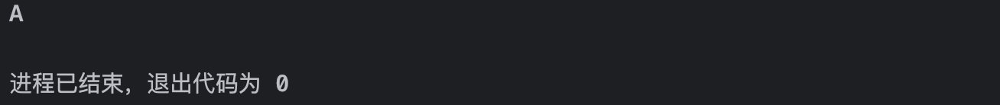

那么可能会有小伙伴好奇，字符类型在计算机底层是怎么进行存储的呢？实际上每个字符在计算机中都会对应一个字符码，首先我们需要介绍ASCII码：

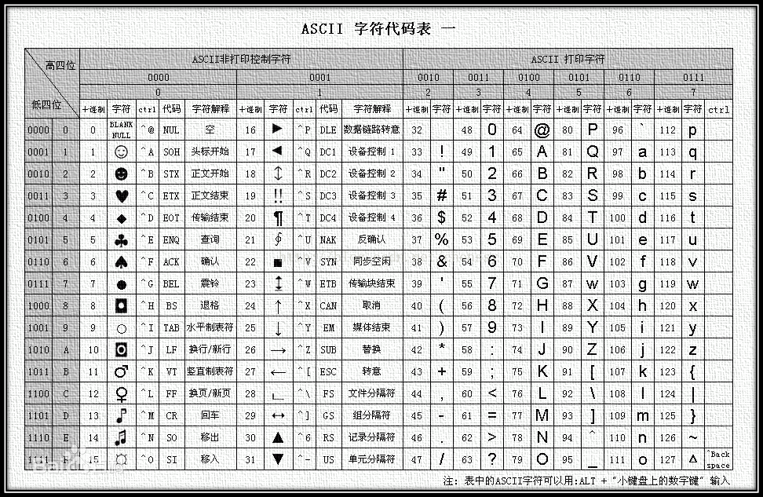

比如我们的英文字母`A`要展示出来，那就是一个字符的形式，而其对应的ASCII码值为65，我们可以使用`.code`来获取某个字符对应的ASCII码，比如下面这样：

```kotlin
fun main() {
    val c: Char = 'A'
    println(c.code)   //这里就会打印字符对应的ASCII码
}
```

得到结果为：

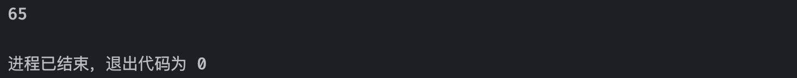

字符型占据2个字节的空间用于存放数据：

- char 字符型（16个bit，也就是2字节，它不带符号）范围是0 ~ 65535

不过，这里的字符表里面不就128个字符吗，那`char`干嘛要两个字节的空间来存放呢？我们发现表中的字符远远没有我们所需要的那么多，这里只包含了一些基础的字符，中文呢？那么多中文字符（差不多有6000多个），用ASCII编码表那128个肯定是没办法全部表示的，但是我们现在需要在电脑中使用中文，这时，我们就需要扩展字符集了。

> Unicode是一个用于表示文本字符的标准字符集。它包含了世界上几乎所有的已知字符，包括不同国家和地区的字母、数字、标点符号、符号图形以及特殊的控制字符。
>
> 与Unicode不同，ASCII（American Standard Code for Information Interchange）是一个只包含128个字符的字符集。它最初是为了在计算机系统中传输基本英语字符而设计的。ASCII字符集包含了常见的拉丁字母、数字、标点符号以及一些特殊字符。
>
> Unicode采用了一个更加广泛的字符编码方案，包括了不同的字符集编码，比如UTF-8和UTF-16等。UTF-8是一种可变长度的编码方案，它可以用来表示Unicode中的任意字符，且向后兼容ASCII字符集。而UTF-16则是一种固定长度的编码方案，它使用两个字节来表示一个Unicode字符。
>
> 与ASCII相比，Unicode的主要优势在于它能够表示各种不同的语言和字符，而不仅仅限于英语字符。这使得Unicode成为全球通用的字符编码标准，为不同国家和地区的语言提供了统一的编码方式。

所以，一个Char就能表示几乎所有国家语言的字符，这样就很方便了。

接着来介绍一下转译字符，对于一些我们平时很难直接通过键盘或是输入法打出来的字符，比如一些特殊符号：


这些符号我们没办法直接打出来，但是现在我们又想要表示它们，该怎么做呢？我们可以使用转义来将这些字符对应的Unicode编码转换为对应的字符，只需要在前面加上`\u`即可，比如✓这个符号：

```kotlin
fun main() {
    val c = '\u2713'   //符号✓对应的Unicode编码为10003，这里需要转换为16进制表示，结果为0x2713
    println(c)
}
```

除了能像这样表示一个特殊字符，我们也可以使用一些其他的转义字符来表示各种东西：

- `\t` – 选项卡
- `\b` – 退格
- `\n` – 换行（LF）
- `\r` – 回车（CR）
- `\'` – 单引号
- `\"` – 双引号
- `\\` –反斜杠
- `\$` – 美元符号

这些转义字符都是为了防止在特殊情况下无法表示某些字符，而给我们的替代方案，后续各位小伙伴在使用时可以回来参考一下。

## 字符串介绍

字符串类是一个比较特殊的类型，它用于保存字符串。我们知道，基本类型`Char`可以保存一个2字节的Unicode字符，而字符串则是一系列字符的序列，它的类型名称为`String`。

字符串通常由双引号`""`囊括，它可以表示一整串字符：

```kotlin
val str: String = "Hello World"
```

注意，字符串中的字符一旦确定，无法进行修改，只能重新创建。

如果我们需要再字符串中换行，需要用到转义字符，字符串中同样支持使用转义字符：

```kotlin
fun main() {
    val text = "Hello\nWorld"
    println(text)
}
```

不过，字符串只能写一行，有时候有点不太够用，可能我们想要打印多行文本，我们除了用`\n`转义字符来换行之外，也可以直接使用三个双引号`"""`来表示一个原始字符串，但是原始字符串无法使用转义字符：

```kotlin
fun main() {
    val text = """
    这是第一行
    这第二行
    别\n了，没用
    真牛逼啊，这功能隔壁Java15才有
    """
    println(text)
}
```

效果如下：

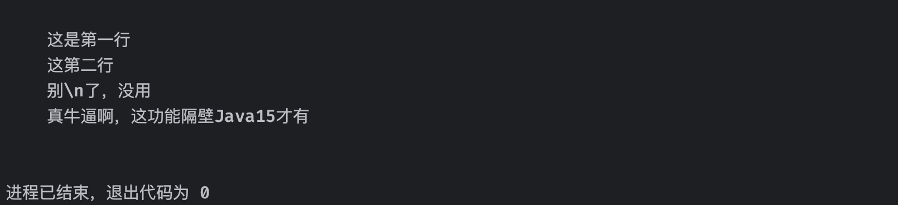

有时候为了方便，我们可以将不同的字符串拼接使用：

```kotlin
fun main() {
    val str1 = "Hello"
    val str2 = "World"
    val str = str1 + str2
    println(str)   //使用 + 来拼接两个字符串，得到的结果就是两个字符串合在一起的结果
}
```

字符串除了和字符串拼接之外，也可以和其他类型进行拼接：

```kotlin
fun main() {
    val a = 10
    val text = "这是拼接的值" + a
    println(text)   //打印出来就是与其他类型的拼接结果
}
```

但是我们需要注意字符串拼接的顺序，只能由字符串拼接其他类型，如果是其他类型拼接字符串，可能会出现问题：

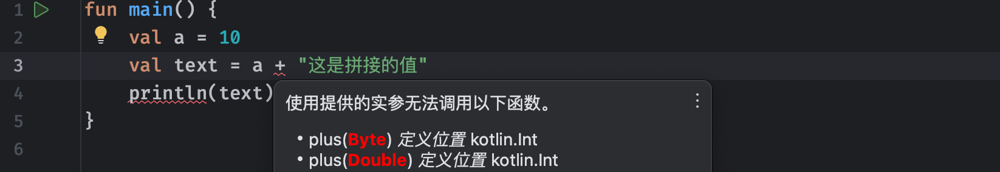

但是现在我们就是希望其他类型的数据拼在最前面，这里应该怎么做呢？我们可以使用字符串模版来完成：  

```kotlin
fun main() {
    val a = 10
    val text = "这是拼接的值$a"  //这里的$为模版表达式，可以直接将后面跟着的变量或表达式以字符串形式替换到这个位置
    println(text)
}
```

如果要添加到前面：

```kotlin
val text = "$a 这是拼接的值" //注意这里$a之后必须空格，否则会把后面的整个字符串认为这个变量的名字
```

出现这种情况除了用空格去解决之外，我们也可以添加一个花括号：

```kotlin
val text = "${a}这是拼接的值"  //添加花括号就可以消除歧义了
val text = "${a > 0}这是拼接的值"  //花括号中也可以写成表达式
```

由于美元符用于模版表达式了，所以说如果我们希望在字符串中仅仅表示$这个字符，那么我们需要用到转义：

```kotlin
val text = "\$这是美元符"   //普通字符串直接使用\$表示
//原始字符串要套个娃
val str = """
  ${'$'}这是美元符    
	"""
```

至此，关于Kotlin的变量与基本类型的内容我们就暂时告一段落了，不过在后面学习了更多知识后，我们还会回顾这些基本类型，了解他们的更多用法，并且认识我们唯一没有在这一部分介绍的数组类型。

## 流程控制

程序都是从上往下依次运行的，但是，仅仅是这样还不够，我们需要更加高级的控制语句来使得程序更加有趣。比如，判断一个整数变量，大于1则输出yes，小于1则输出no，这时我们就需要用到选择结构来帮助我们完成条件的判断和程序的分支走向。

我们可以通过逻辑运算符和关系运算符对某些条件进行判断，并得到真或是假的结果。这一部分我们将继续使用这些运算符进行各种判断，以及实现流程控制。

### 选择结构(if-else)

某些时候，我们希望进行判断，只有在条件为真时，才执行某些代码，这种情况就需要使用到选择分支语句，首先我们来认识一下`if`语句：

```kotlin
if (条件判断) 判断成功执行的代码;
```

`if`的小括号中需要我们传入一个Boolean类型的结果，可以是一个Boolean变量，也可以是一个判断语句，反正只能接受true和false两种结果，比如下面的这个例子：

```kotlin
fun main() {
    val a = 10
    if(a == 12)  //只有当a判断等于12时，才会执行下面的打印语句
        println("Hello World!")
    println("我是后续的语句")  //if只会对紧跟着的一行代码生效，后续的内容无效
}
```

`if`会进行判断，只有判断成功时才会执行紧跟着的语句，否则会直接跳过，注意，如果我们想要在if中执行多行代码，需要使用代码块将这些代码囊括起来（实际上代码块就是将多条语句复合到一起，使用花括号囊括）所以说，我们以后使用if时，如果分支中有多行代码需要执行，就需要添加花括号，如果只有一行代码，花括号可以直接省略，包括我们后面会讲到的else、while、for语句都是这样的，就像下面这样：

```kotlin
fun main() {
    val a = 15
    if (a > 10) {    //只有判断成功时，才会执行下面的代码块中内容，否则直接跳过
        println("a大于10")
        println("a的值为：$a")
    }
    println("我是外层")
}
```

如果希望判断条件为真时执行某些代码，条件为假时执行另一些代码，我们可以在后面继续添加else语句：

```kotlin
fun main() {
    val a = 15
    if (a > 10) {    //只有判断成功时，才会执行下面的代码块中内容，否则直接跳过
        println("a大于10")
        println("a的值为：$a")
    } else {   //当判断不成功时，会执行else代码块中的代码
        println("a小于10")
        println("a的值为：$a")
    }
    println("我是外层")
}
```

`if-else`语句就像两个分支，跟据不同的判断情况从而决定下一步该做什么，这跟我们之前认识的三元运算符性质比较类似。

那如果此时我们需要判断多个分支呢？比如我们现在希望判断学生的成绩，不同分数段打印的等级不一样，比如90以上就是优秀，70以上就是良好，60以上是及格，其他的都是不及格，那么这种我们又该如何判断呢？要像这样进行连续判断，我们需要使用`else-if`来完成：

```kotlin
fun main() {
    val score = 2
    if (score >= 90) //90分以上才是优秀
        println("优秀") 
    else if (score >= 70) //当上一级if判断失败时，会继续判断这一级
        println("良好") 
    else if (score >= 60) 
        println("及格") 
    else  //当之前所有的if都判断失败时，才会进入到最后的else语句中
        println("不及格")
}
```

当然，`if`分支语句还支持嵌套使用，比如我们现在希望低于60分的同学需要补习，0-30分需要补Java，30-60分需要补C++，这时我们就需要用到嵌套：

```kotlin
fun main() {
    val score = 2
    if (score < 60) {   //先判断不及格
        if (score > 30) //在内层再嵌套一个if语句进行进一步的判断
            println("学习C++") 
        else 
            println("学习Java")
    }
}
```

除了if自己可以进行嵌套使用之外，其他流程控制语句同样可以嵌套使用，也可以与其他流程控制语句混合嵌套使用。这样，我们就可以灵活地使用`if`来进行各种条件判断了。

除了直接执行语句之外，我们也可以将if和else用作结果判断，比如：

```kotlin
fun main() {
    val score = 2
  	//这里判断socre是否大于60，是就得到Yes，否就得到No，并且可以直接赋值给变量
    val res = if (score > 60) "Yes" else "No"
}
```

这类似于其他语言，如Java和C中的三元运算，不过Kotlin中没有那样的三元运算符，只能使用上面的表达式，对于多行代码块的情况，默认最后一行作为返回的结果：

```kotlin
fun main() {
    val score = 2
    val res = if (score > 60) {
        println("不错啊期末没挂科")
        "Yes"   //代码块默认最后一行作为返回结果
    } else {
        println("不会有人Java期末还要挂科吧")
        "No"
    }
}
```

注意，如果需要这种返回结果的表达式，那么必须要存在`else`分支，否则不满足条件岂不是没结果了？

### 选择结构 (when)

前面我们介绍了if语句，我们可以通过一个if语句轻松地进行条件判断，然后根据对应的条件，来执行不同的逻辑，当然除了这种方式之外，我们也可以使用`when`语句来实现，它更适用于多分支的情况：

`when`定义具有多个分支的条件表达式。它类似于类似Java和C语言中的`switch`语句，它简单的形式看起来像这样：

```kotlin
when (目标) {
    匹配值1 -> 代码...   //我们需要传入一个目标，比如变量，或是计算表达式等
    匹配值2 -> 代码...   //如果目标的值等于我们这里给定的匹配值，那么就执行case后面的代码
    else -> {
        代码...    //如果以上条件都不满足，就进入else中（可以没有），类似于之前的if-elseif-else
    }
}
```

比如现在我们要根据学生的等级进行分班，学生有ABC三个等级：

```kotlin
fun main() {
    val c = 'A'
    when (c) {
        'A' -> println("去尖子班！准备冲刺985大学！")
        'B' -> println("去平行班！准备冲刺一本！")
        'C' -> println("去职高深造。")
    }
}
```

如果将when用作表达式，则else分支必须存在，除非编译器能推断出所有可能的情况都包含分支条件，比如下面的例子：

```kotlin
fun main() {
    val c = 'A'
    val numericValue = when (c) {
        'B' -> 0
        'A' -> 1
        else -> 2    //还有其他情况，这里必须添加else，不然其他情况岂不是没返回的东西？
    }
}
```

以下情况就可以不需要else语句：

```kotlin
fun main() {
    val c = true
    val numericValue = when (c) {
        false -> 0
        true -> 1
        // 由于Boolean只具备真和假条件，这里的'else' 就不再强制要求
      	// 这同样适用于比如枚举类等
    }
}
```

在`when`*语句*中，遇到以下情况，携带`else`分支是必须的：

- `when`分支中仅有一个`Boolean`类型、枚举 或 密封，以及用于判断的目标变量是可空的情况（后面会讲解）
- `when`分支没有包括该判断目标的所有可能的值。

有时候我们可能希望某些值都属于同一个情况，可以使用逗号将其条件组合成一行：

```kotlin
when (x) {
    0, 1 -> print("x == 0 or x == 1")
    else -> print("otherwise")
}
```

我们也可以使用任意表达式（不仅仅是常量）作为分支条件，比如之前的if-else案例中我们判断学生成绩：

```kotlin
fun main() {
    val score = 10
    val grade = when(score) {
      	//使用in判断目标变量值是否在指定范围内
        in 90..100 -> "优秀"
        in 80..89 -> "良好"
        in 70..79 -> "及格"
        in 60 ..69 -> "牛逼"
        else -> "不及格"
    }
}
```

包括我们之后学习的类型判断`is`表达式、函数调用等，都可以在这里作为分支条件。

通过前面的学习，我们了解了如何使用分支语句来根据不同的条件执行不同的代码，我们接着来看第二种重要的流程控制语句：循环语句。

我们在某些时候，可能需要批量执行某些代码：

```kotlin
fun main() {
    println("大烟杆嘴里塞，我只抽第五代")   //把这句话给我打印三遍
    println("大烟杆嘴里塞，我只抽第五代")
    println("大烟杆嘴里塞，我只抽第五代")
}
```

### 循环结构（for）

我们可以使用for循环语句来多次执行：

```kotlin
for (遍历出来的单个目标变量 in 可遍历目标) 循环体
```

这里的可遍历目标有很多，比如：

- 数组
- 区间
- 任何实现了运算符重载函数iterator的类

这里我们只学习了区间，我们来看看如何使用，比如我们要打印一段话3遍：  

```kotlin
fun main() {
    for (i in 1..3)  //这里直接写入1..3表示1~3这个区间
        println("大烟杆嘴里塞，我只抽第五代：$i")
}
```

打印结果为：

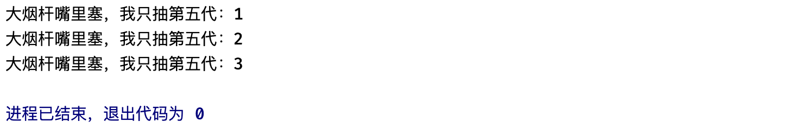

可以看到，每一次遍历出来的变量`i`，其实就是每次遍历的下一个目标，比如这里是1..3的区间，那么得到的依次就是1、2、3这三个结果了，唯一需要注意的是，这里的`i`是局部的，只在`for`循环内部可用（包括嵌套的内部）并不是整个main中都可以使用：

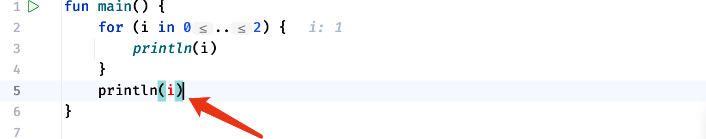

默认情况下，每一轮循环都会向后+1，我们也可以自由控制每一轮增加多少，也就是步长：

```kotlin
fun main() {
    for (i in 1..10 step 2) {
        println(i)
    }
}
```

这样，打印出来的数据会按照步长进行增长：

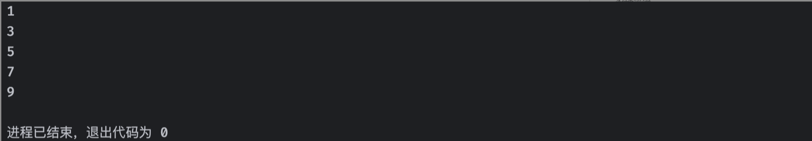

那如果我们需要从10到1倒着进行遍历呢？我们可以将`..`替换为`downTo`来使用：

```kotlin
fun main() {
    for (i in 10 downTo 1) {
        println(i)   //这里得到的就是10到1倒着排列的范围了
    }
}
```

我们可以使用调试来观察每一轮的变化，调试模式跟普通的运行一样，也会执行我们的Java程序，但是我们可以添加断点，也就是说当代码运行到断点位置时，会在这里暂停，我们可以观察当代码执行到这个位置时各个变量的值：

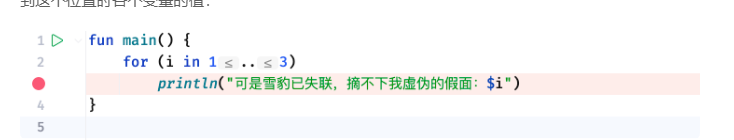

调试模式在我们后面的学习中非常重要，影响深远，所以说各位小伙伴一定要学会。调试也很简单，我们只需要点击右上角的调试选项即可（图标像一个小虫子一样，因为调试的英文名称是Debug）


调试开始时，我们可以看到程序在断点位置暂停了：

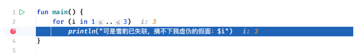

此时我们可以观察到当前的变量`i`的值，也可以直接在下方的调试窗口中查看：

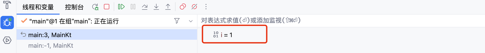

随着循环的进行，i的值也会逐渐自增。

和之前的`if`一样，for循环同样支持嵌套使用：

```kotlin
fun main() {
    for (i in 0..2)  //外层循环执行3次
        for (j in 0..2)  //内层循环也执行3次
            println("外层$i，内层$j")
}
```

上面的代码中，外层循环会执行3轮，而整个循环体又是一个循环语句，那么也就是说，每一轮循环都会执行里面的整个循环，里面的整个循环会执行3，那么总共就会执行3 x 3次，也就是9次打印语句。

我们也可以在循环过程中提前终止或是加速循环的进行，这里我们需要认识两个新的关键字：  

```kotlin
for (i in 0..2) {
    if (i == 1) continue  //比如我们希望当i等于1时跳过这一轮，不执行后面的打印
    println("在这么冷的天")
    println("当前i的值为：$i")
}
```

我们可以使用`continue`关键字来跳过本轮循环，直接开启下一轮。这里的跳过是指，循环体中，无论后面有没有未执行的代码，一律不执行，比如上面的判断如果成功，那么将执行`continue`进行跳过，虽然后面还有打印语句，但是不会再去执行了，而是直接结束当前循环，开启下一轮。

在某些情况下，我们可能希望提前结束循环：

```kotlin
fun main() {
    for (i in 0..2) {
        if (i == 1) break //我们希望当i等于1时提前结束
        println("伞兵一号卢本伟准备就绪！")
        println("当前i的值为：$i")
    }
}
```

可以使用`break`关键字来提前终止整个循环，和上面一样，本轮循环中无论后续还有没有未执行的代码，都不会执行了，而是直接结束整个循环，跳出到循环外部。

虽然使用break和continue关键字能够更方便的控制循环，但是注意在多重循环嵌套下，它只对离它最近的循环生效（就近原则）：

```kotlin
fun main() {
    for (i in 1..3) {
        for (j in 1..3) {
            if (i == j) continue  //当i == j时加速循环
            println("$i, $j")
        }
    }
}
```

这里的`continue`加速的对象并不是外层的for，而是离它最近的内层for循环，`break`也是同样的规则：

```kotlin
fun main() {
    for (i in 1..3) {
        for (j in 1..3) {
            if (i == j) break //当i == j时终止循环
            println("$i, $j")
        }
    }
}
```

那么，要是我们就是想要终止或者是加速外层循环呢？我们可以为循环语句打上标记：  

```kotlin
fun main() {
    outer@ for (i in 1..3) {   //在循环语句前，添加 标签@ 来进行标记
        inner@ for (j in 1..3) {
            if (i == j) break@outer  //break后紧跟要结束的循环标记，当i == j时终止外层循环
            println("$i, $j")
        }
    }
}
```

关于for语句的更多用法，我们会在后续的学习中继续认识。

### 循环结构（while）

前面我们介绍了for循环语句，我们接着来看第二种while循环，for循环要求我们给一个可遍历的目标，而while相当于是一个简化版本，它只需要我们填写循环的维持条件即可，比如：


```kotlin
while(循环条件) 循环体;
```

相比for循环，while循环更多的用在不明确具体的结束时机的情况下，而for循环更多用于明确知道循环的情况，比如我们现在明确要进行循环10次，此时用for循环会更加合适一些，又比如我们现在只知道当`i`大于10时需要结束循环，但是`i`在循环多少次之后才不满足循环条件我们并不知道，此时使用while就比较合适了。

```kotlin
fun main() {
    var i = 100 //比如现在我们想看看i不断除以2得到的结果会是什么，但是循环次数我们并不明确

    while (i > 0) {   //现在唯一知道的是循环条件，只要大于0那么就可以继续除
        println(i)
        i /= 2 //每次循环都除以2
    }
}
```

上面的这种情况就非常适合使用while循环。

和for循环一样，while也支持使用break和continue来进行循环的控制，以及嵌套使用：

```kotlin
fun main() {
    var i = 100
    while (i > 0) {
        if (i < 10) break
        println(i)
        i /= 2
    }
}
```

我们也可以反转循环判断的时机，可以先执行循环内容，然后再做循环条件判断，这里要用到`do-while`语句：

```kotlin
fun main() {
    var i = 0 //比如现在我们想看看i不断除以2得到的结果会是什么，但是循环次数我们并不明确

    do {  //无论满不满足循环条件，先执行循环体里面的内容
        println("Hello World!")
        i++
    } while (i < 10) //再做判断，如果判断成功，开启下一轮循环，否则结束
}
```

